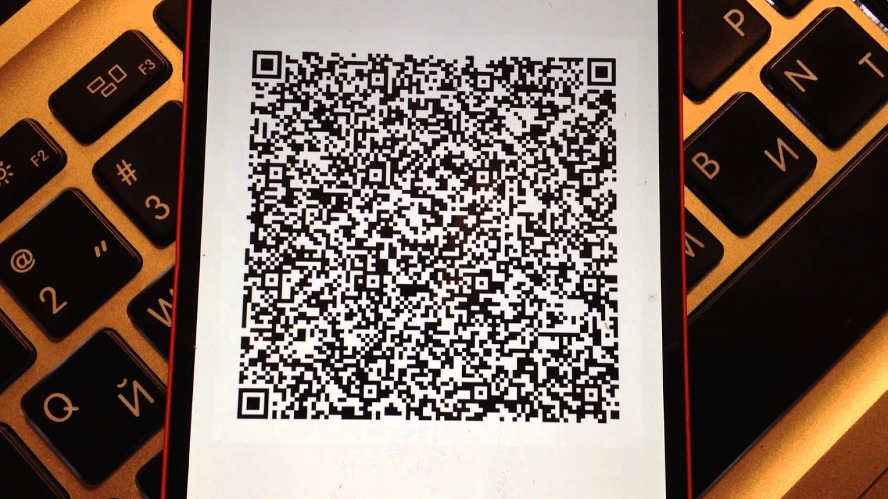

На днях мне пришла в голову странная идея. В действительности не такая странная, так, обычная. Просто почему бы не написать приложение под Android для передачи файлов между устройствами с помощью [QR кодов](https://ru.wikipedia.org/wiki/QR-код).

Да, я снова взялся за старое, не достаточно мне было [передачи данных вспышкой](https://www.youtube.com/watch?v=BZ4PDgjlmb4), а также через аудио разъём. Поэтому опять появилась идея с нестандартным способом отправки файлов. Закономерно спросить, а что здесь такого особенного? QR и так позволяет отправлять небольшие кусочки информации, даже бинарной(около 2953 байт). Но только представьте как это прикольно выглядит — один смартфон очень быстро меняет на своем экране QR коды, в то время как другой считывает их камерой. Никаких bluetooth, wifi, irda и прочей беспроводной магии. А QRTransmitter — вот это действительно *беспроводная* передача! А скорость? По моим расчетам в худшем случае будет приблизительно 1кб/с. Возможно получиться ускорить до 5–6кб/с, пока не знаю.

Ближе к делу. За один вечер пока получилось сделать только генератор кодов. Приемник еще обдумываем вместе с [Кириллом](https://medium.com/@KirillMegabozya). А пока можно посмотреть забавный ролик. Потом обязательно покажу как будет работать приемник и расскажу больше технических деталей. А как же, даже в таком приложении будут интересные проблемы, например, синхронизация передатчика и приемника, выбор оптимальной частоты, определение начала и остановки.



Для друзей программистов — пишем андроиде приложение на scala+gradle. Исходники [тут](https://github.com/cat-in-the-dark/QRTransmitter).
