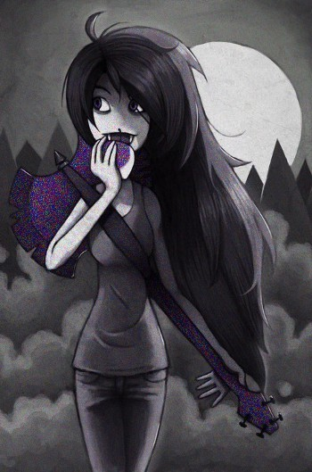
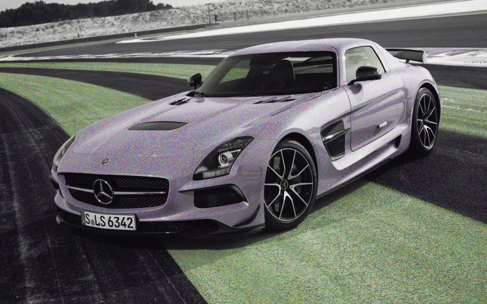
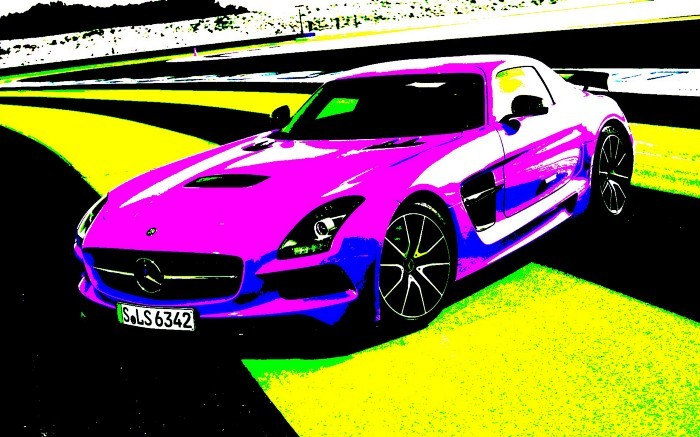
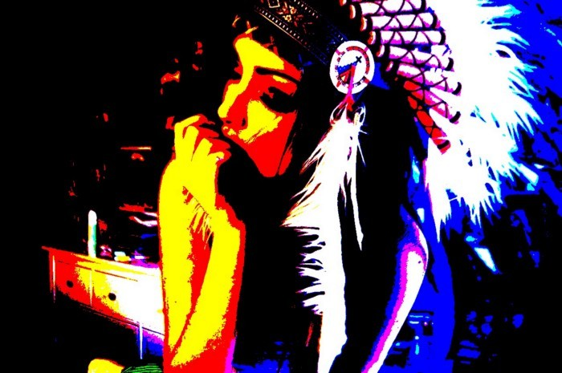

Нет времени объяснять-через 20 минут начинается тренировка. Просто выкладываю новую порцию картинок. Теперь я произвёл случайное перемешивание каналов.

Берем 3 канала RGB. Существует всего 3! = 6 возможных перестановок. Каждую перестановку выбираем с равными вероятностями \frac{1}{6}. То есть равномерное дискретное распределение. Ожидается, что картинка становится почти монохромной. Так и оказалось.

## Мультик-преобразование

Следующее преобразование- берем яркость канала, если она больше половины яркости, то делаем её максимальной, иначе минимальной. Я забыл как называется этот эффект, кто знает фотошоп скажите.

Усиление каналов. Получаем вроде всего 8 цветов — red green blue black white cyan magenta yellow.

Няшке опять не везет. Но когда-нибудь я найду эффект, который сделает картинку фееричной.

## Исходники

https://gist.github.com/senior-sigan/5301188
