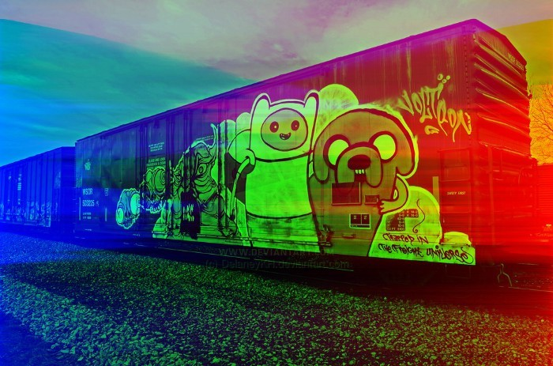

Пятница, и этим всё сказано. Насладимся же сортировкой изображения. Я написал построчечную сортировку каналов и полную. Некоторые результаты были весьма неожиданными, особенно segmentation fault, иногда :D.

## Частичная сортировка

Начнем с сортировки красного канала. Напомню, что машина желтая. Выглядит как закат. Ну почти.



А теперь отправим синий канал в другую сторону.



Картинка всё еще похожа на оригинал. НУЖНО ИСПРАВИТЬ ЭТОТ НЕДОЧЕТ.

Вот это я понимаю искусство. Полная сортировка всех каналов в левую сторону. Поздравляю. Так бы выглядела машина на десятой скорости света.
Мне так понравился эффект растаскивания цветов в разные стороны, что сделал еще несколько экземпляров.

Хорошо, а вот еще одна подопытная няша. Отсортируем её полностью.

УПС. это не то чего я ожидал. Тьфу ты, перепутал сортировку. Часть каналов отсортирована полностью другая часть — нет. Короче я не понял, что тут произошло. Наверное баг в проге.

Вот это другое дело. Полностью отсортированная картинка. Назовем её розовый градиент [s]Малевича[/s].
Это всё. В следующем выпуске я покажу как один пиксель может “сломать” всю картинку.

## Исходники

https://gist.github.com/senior-sigan/5319705
