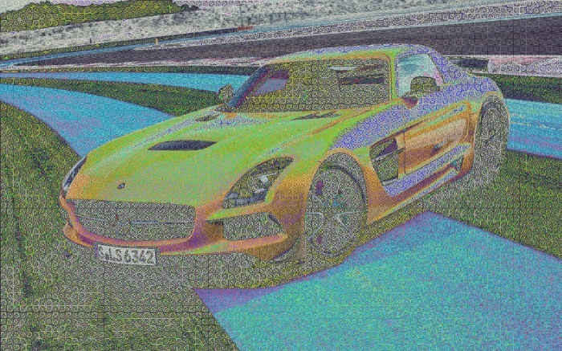

Сегодня был очень длинный день. Поэтому для поддержания себя в бодром состоянии, я написал следующий сценарий искажения фоток. Вас ждет снова много “вещественных” преобразований. Надеюсь, я придумаю как делать фотки пастельными, а не мерзео-эпилептическими. Итак, сегодня на очереди — применение функций от координат на насыщенность каналов. Кто хочет- может посмотреть исходники, я там замутил массив указателей на функции. Описания под картинками.

## X/Y

Значение канала * (x/y). Только вот незадача. Я не перевёл во float, поэтому видны резкие границы разделения.



Теперь плавное использвание x/y.



## Логарифм

Логарифм произведения координат. По-моему это самый прикольный результат.



А что если взять log(x/y)?



Ещё один экземпляр. (прим. времени — через 2 года уже не могу вспомнить, что тут за функция. Имя файла xyyx.)



## Sin

Quant*sin(x*y). Советую открыть оригинал и приблизить. Зрелище ооооочень странное.



Тоже синус, но с более слабыми коэффициентами.

В следующей серии я покажу что будет если не менять цвет пикселей, а менять их местами.

## Исходники

https://github.com/senior-sigan/magick/blob/master/function.h
