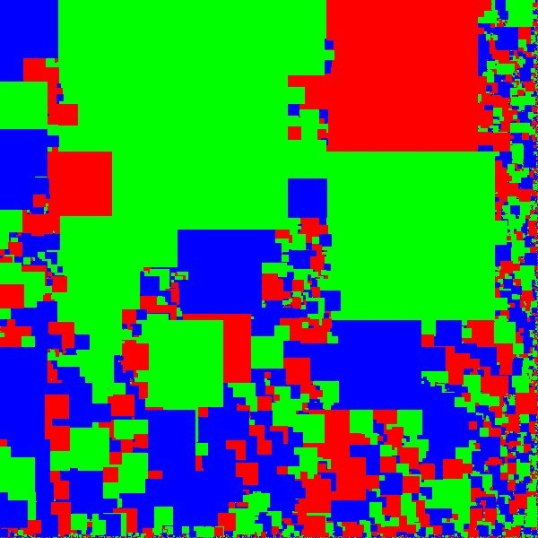
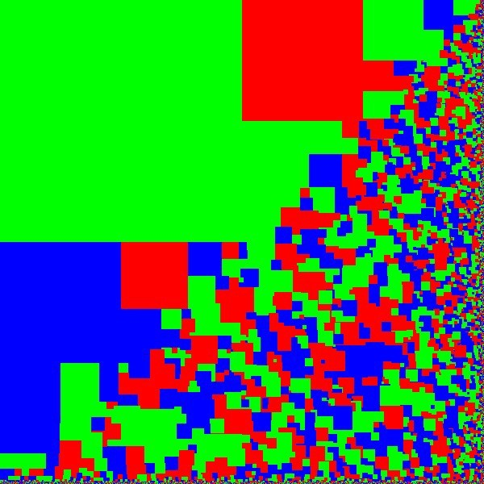
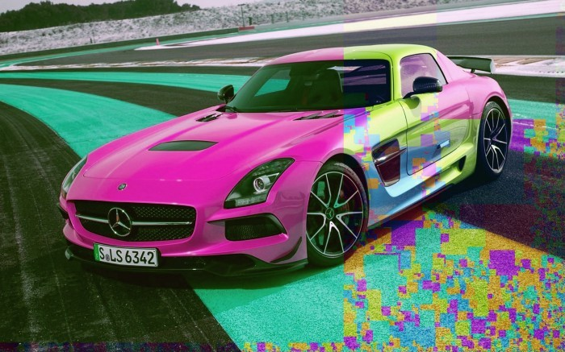
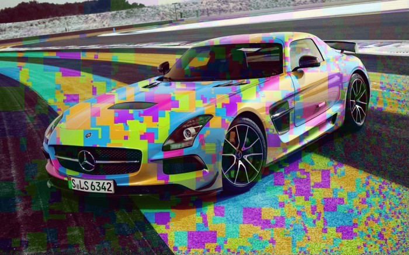
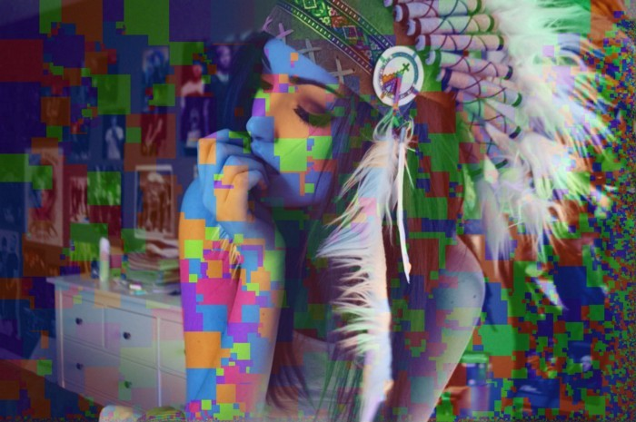
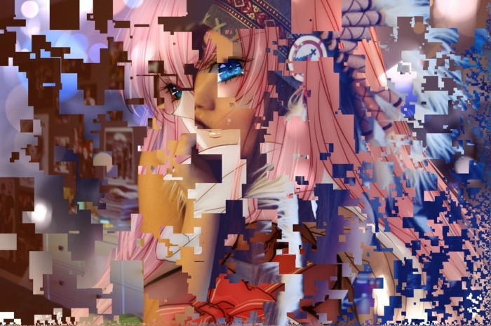

Привет!
Сегодня у нас уроки кирпичизма. Надеюсь m$oft не наедет на меня за использование прямоугольников. Итак, что будет если мы разобьем матрицу на много подматриц произвольной формы? А если при этом произведем какую-нибудь операцию над подматрицей? Так вот, написал я тут алгоритм, наверное очень тупо, так как картинку 1900*1200 он обрабатывает десяток секунд, который перемешивает каналы у данной подматрицы. Не переживайте, я разовью эту идею дальше и будет очень забавно.

## Генерация матриц

Существует 2 вида подматриц- синие зеленые и красны. Размер выбирается как случайное число.

А здесь размер выбирается как половина от ширины матрицы. Очевидно прогрессия \frac{1}{2})^n. Ну или почти такая. Не суть.

Теперь случайное перемешивание в подматрицах. Обычный рандом дает не очень клевый результат.

Тут волей случая первая подматрица оказалась очень большой. FIX IT!!!!
Вот то-то же. Нам нужен был true_random. Здесь выбирается средний размер квадратов с некоторой дельтой. Вот так красить машины надо. Это я понимаю искусство.

Теперь перекрасим няшку.

> Тебя теперь интел засудит, у них вся реклама в таком стиле)

## Смешивание картинок

Нет времени объяснять, прямоугольники захватывают мир……………

От сложения няшек, няшность не возросла T_T.

## Исходники

https://github.com/senior-sigan/magick/blob/master/brick.h
