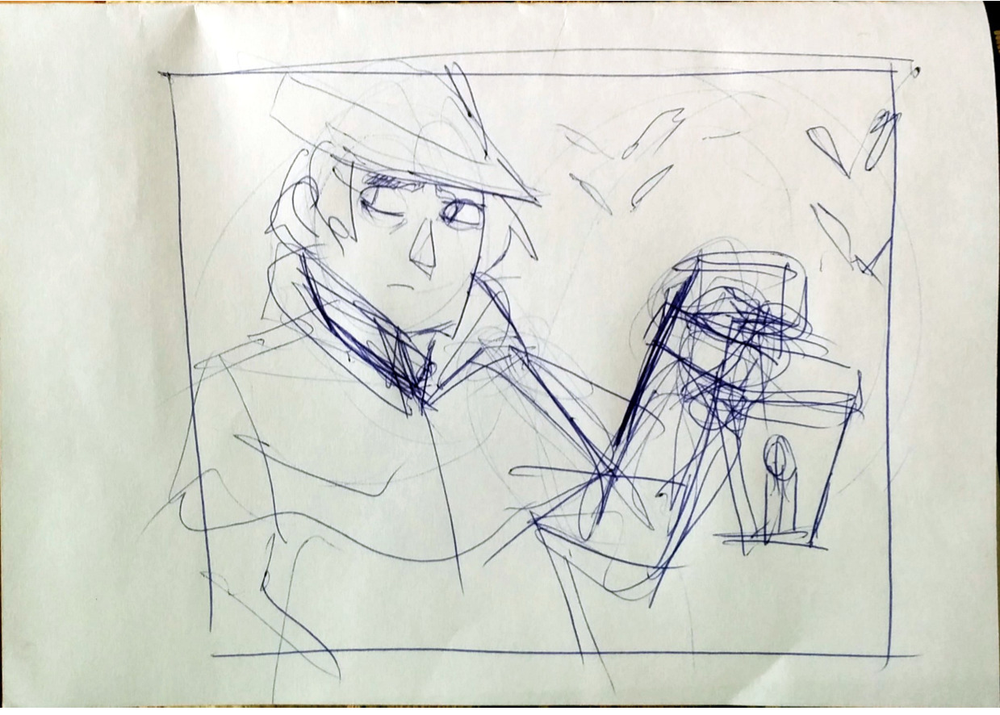
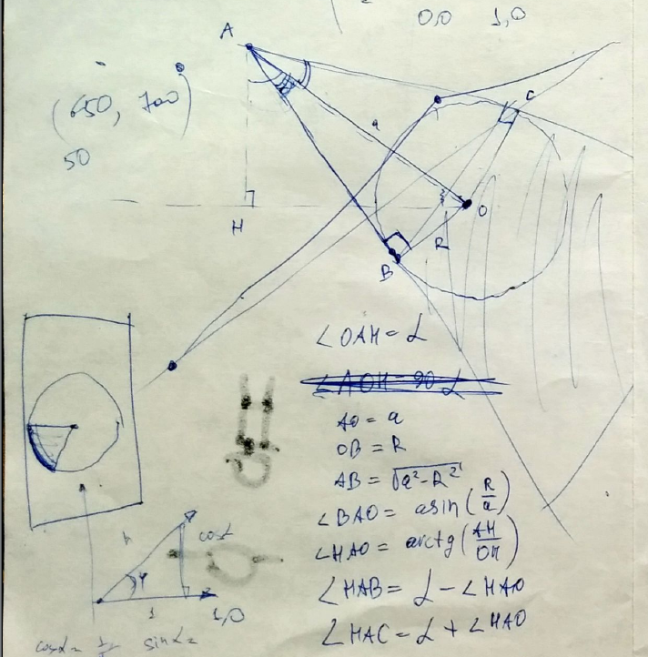
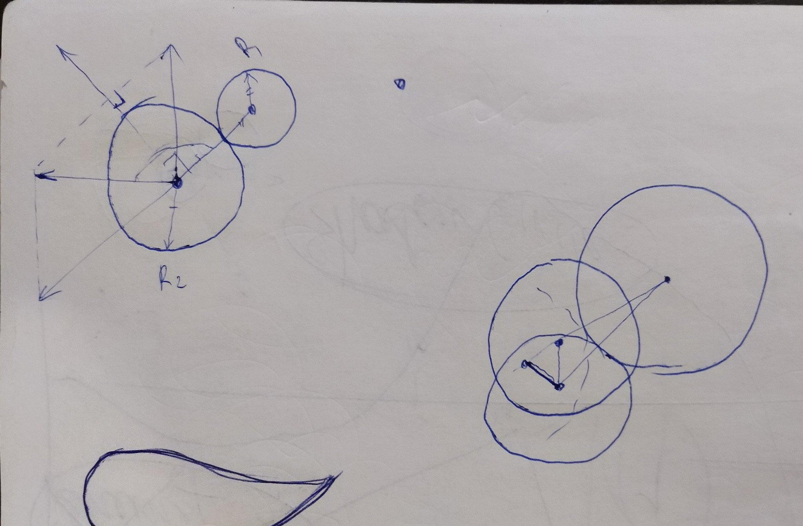
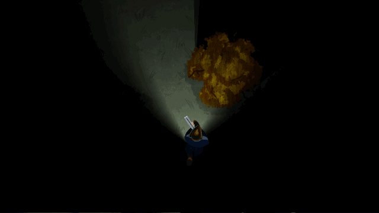
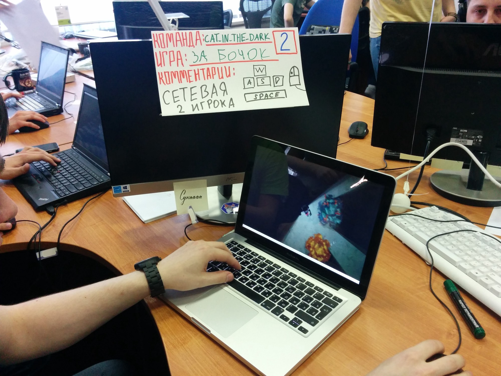
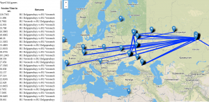

That's our 9th Ludum Dare, so we decided to make something challenging this time. We've tried to create multiplayer action-horror-shooter thingy with two characters trying to kill each other. One is a werewolf (short-range attack, wide angle of view), another one is a hunter (long-range attack, small view angle and viewing distance). And yeah, that was pretty challenging indeed for some reasons.

## Networking

We've made our first network game for LD#34. It was quite primitive, a peer-to-peer game for two players. But it proved that our team can handle network-game-specific issues and make network game at least playable. This time we decided to go further and create a server which would interconnect all game instances into pairs. That is still quite simple client-server architecture, but it required lots of time to implement and some knowledge of websockets magic.

## Dynamic shadows

Our game is based on LibGDX engine which is quite simple and, of course, doesn't have any built-in shadow support. So, shadows were made using a bunch of black triangles, dozens of math and sorting obstacles by distance, from farther to closer.

## Collisions detection

Trigonometry magicCharacters should not go through trees, right? LibGDX has built-in box2d engine support, but for such simple task, it adds so much overhead to code that we decided to make everything on our own. That required some math too, and sometimes led to funny bugs such as trees making you stuck inside them and tear you apart.

## Soft torch beam effect

Dynamic shadowsIt may look simple. But inside it carries some OpenGL vertex and fragment shaders magic. One of us spent 5 hours or something making this effect look properly and be configurable too. This soft-beam torch effect could be also achieved with gradient transparent bitmap, but it would be less challenging and less funny to make.

## Balancing and small details

After basic game mechanics was complete, we decided to add some more features to fix the game balance and make it more interesting to play. First, we've made a wolf jump over the trees to compensate hunter's advantage in attack range, and then we've added traces to our characters to help them find each other in the dark forest. To balance a game a bit more, we've added sounds of characters' steps so players could hear each other walking. This also makes a game more atmospheric.

After all, we are completely happy with the result and we hope you'll enjoy playing this. It's hard to find opponent sometimes, so be ready to grab your friend and play with him over the Internet.

We also had a page with game statistics and Telegram chat for everyone who wants to receive notifications about active players waiting for an opponent.

You can download and play our game from [here](https://catinthedark.itch.io/za-bochok).

Gameplay video: 

Also we have a development timelapse.


_[originally posted on medium in 2016–04–26](https://medium.com/cat-in-the-dark/multiplayer-game-on-the-ludum-dare-35-jam-oh-rly-77d5dd04d51c) by [Kirill Leyfer](https://medium.com/@KirillLeyfer) and [Ilya Siganov](https://dev.to/senior_sigan)_
