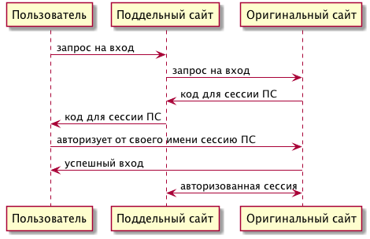
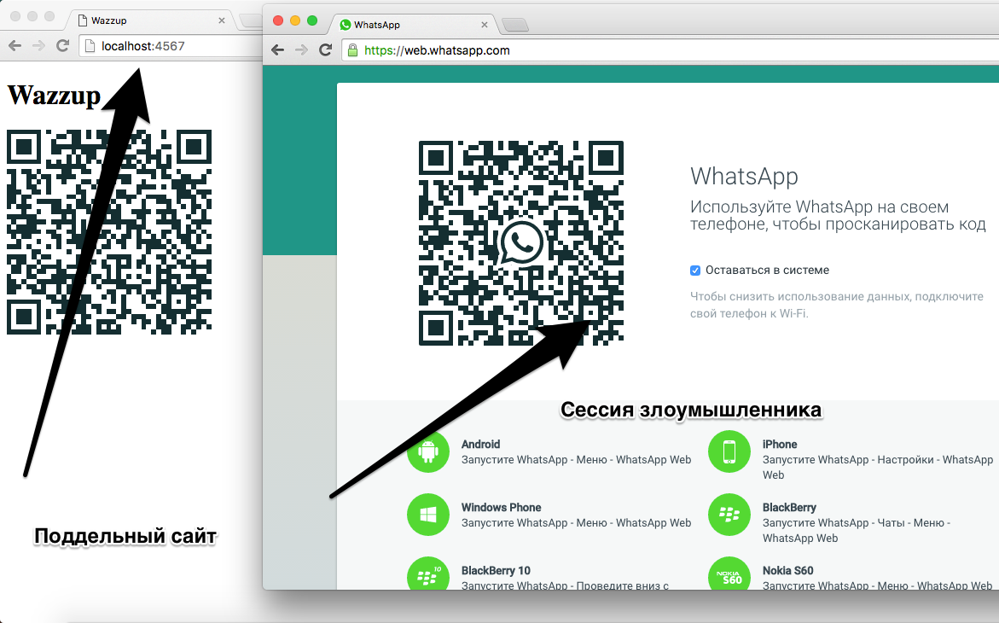

> TL;DR; Описание фишинговой атаки на WhatsApp.

Последнее время я все чаще вижу как сервисы внедряют у себя беспарольную (passwordless) аутентификацию. Всем стало уже привычно использовать SMS коды для входа в telegram, viber, etc… Но некоторые ребята идут еще дальше — внедряют QR-коды для входа в веб-версию их приложения. Не будем ходить далеко за примером, возьмем WhatsApp. Вот страница входа [web.whatsapp.com](https://web.whatsapp.com/). Чтобы аутентифицировать себя в системе нужно отсканировать QR-код через приложение WhatsApp и, вуяля, вы вошли в веб версию чата. Вау-эффект гарантирован. Да и выглядит это безопаснее — не надо вводить пароли, и удобнее — не нужно ждать SMS.

С такими новыми системами появляется иллюзорное ощущение, что вот теперь мы действительно находимся в безопасности. Никто не украдет пароль от аккаунта, так как пароля не существует в принципе. Кажется, что даже [фишинг](https://ru.wikipedia.org/wiki/Фишинг) нам не страшен!(т.е. заманивание жертвы в ловушку так, чтобы она ввела свой пароль куда не надо)

Но что если я вам скажу, что и здесь есть вектор атаки. Можно угнать аккаунт, хотя бы на несколько секунд, пока жертва не заметит неладное. Но прежде всего расскажу теорию.

## “Проблема гроссмейстера”

Мэллори не умеет играть в шахматы. Но ради славы и зрелища она объявила турнир в шахматы сразу двум великим гроссмейстерам — Алисе и Бобу. И играть она будет против двух мастеров ОДНОВРЕМЕННО, точно так же как Остап Бендер против Васюков. С Алисой он будет играть черными, а с Бобом — белыми. И как вы уже догадались, будет копировать ходы Алисы и Боба в партиях. То есть по факту Алиса будет играть против Боба, через посредника.

Как результат этого получаем обман, выполненный мафией.

## “Обман, выполненный мафией”

В городе обитает мафия. Одного из представителей зовут Ева, и она держит милый ресторанчик в центре города. Второго — Мэллори; он любит работать в “поле”. Так же из действующих лиц у нас есть Боб, заведующий ювелирным магазином на окраине города.

Доверчивая девушка Алиса пошла на бизнес ланч в ресторан “У Евы”. В этот же самый момент, как и договаривались Ева и Мэллори, Мэллори отправился в ювелирный магазин Боба. После чудесной трапезы Алиса подходит к кассе и по особому протоколу начинает доказывать, что она та за кого себя выдает и что мы можем снять с её счета деньги. В этот же самый момент Ева в тайне от Алисы передает ей все шаги доказательства Мэллори. Он в свою очередь в магазине Боба выдает себя за Алису, используя её доказательство и снимает кучу денег покупая дорогое кольцо. Профит!

“И как же это связано с WhatsApp,— спросите вы. На что я отвечу: “Непосредственно”. Распишем роли: WhatsApp — Боб, приложение в нашем смартфоне — Алиса, фишинговый сайт — Мэллори и Ева.

## Эксплуатируем уязвимость!

1. Жертва заходит на фишинговый сайт, как две капли воды похожий на оригинальный [WhatsApp](https://web.whatsapp.com/).
2. Жертва видит знакомый ей QR-код и приглашение сканировать его приложением, что она и делает.
3. Каким-то чудом оказывается, что жертва аутентифицровала сессию злоумышленника.

Как же все это провернуть? Оказывается очень просто. Для этого нам понадобится:

1. [Selenium Web driver](http://www.seleniumhq.org/), нужный для получения QR-кода из WhatsApp.
2. [Простенький сервер,](https://github.com/blan4/Wazzup) который будет запускать селениум и передавать полученный код на фишинговую страницу.

Жертва заходит на [http://localhost:4567](http://localhost:4567/) — это сайт злоумышленника. В этот момент запускается selenium и открывает сессию с [https://web.whatsapp.com](https://web.whatsapp.com/). Специальный скрипт ищет на странице QR-code и отправляет его жертве.

## Недостатки

1. Жертва заметит неладное и сразу же нажмет на смартфоне кнопку “выйти со всех устройств”. Но до этого времени будет секунд 5–10 чтобы сделать грязные делишки.
2. Время ожидания загрузки фейковой странице в два раза больше, чем у оригинального сайта.

## Заключение

Вы конечно ради интереса можете ознакомится с исходниками сервера, который делает что-то подобное. Там нет ничего страшного, строчек [30 джава кода](https://github.com/senior-sigan/Wazzup).

Да и в описанной уязвимости нет ничего неожиданного. Это очевидная проблема систем “нулевого разглашения” и подобных.

Что можно сделать, чтобы в вашем супер сервисе не было даже таких проблем? Единственное что мне пришло в голову — это после сканирования кода показывать пользователю уведомление “запрос на вход был произведен с такого-то user-agent (но его можно подменить😕) и с такого-то IP-адреса и локации (города)”.

Но как известно, *абсолютно защищенная система абсолютно не работает.*